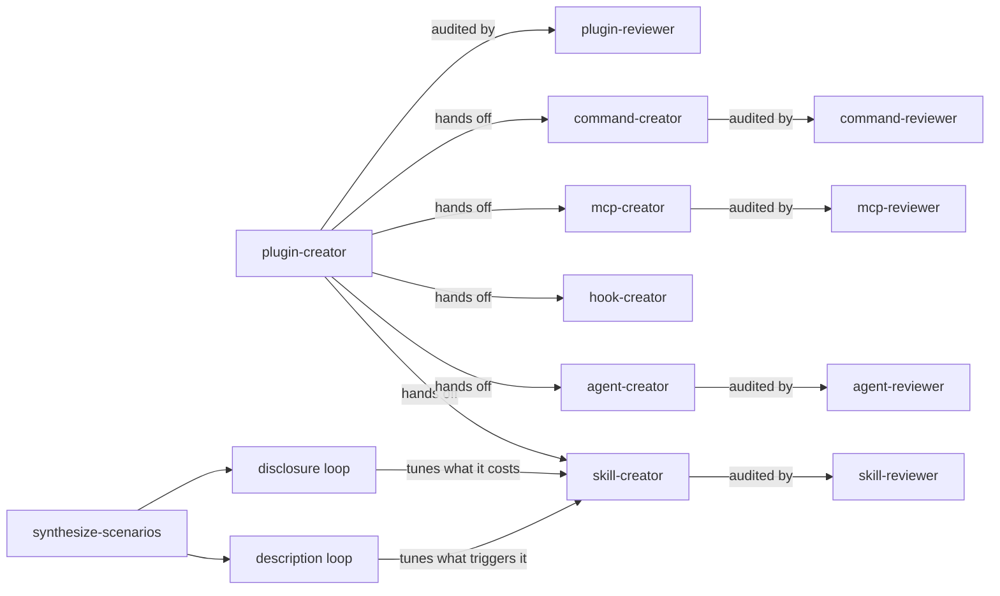

# plugin-kit

A Claude Code plugin for building the things that extend Claude Code — skills,
subagents, hooks, MCP servers, slash commands — and the plugin that carries them.

The name is the umbrella: everything in the kit either *is* a plugin or lives
inside one. Subagents, hooks and slash commands have no standalone install path
off Claude Code at all, and skills usually travel bundled too.

Each component type gets the same treatment — a creator skill that authors it, a
read-only auditor that checks it without changing it, and a measured loop that
shows whether a change actually helped rather than whether it felt better. For the
five components that treatment is a reviewer agent; for the plugin itself it is
`claude plugin validate --strict`.

It began as a merge of Anthropic's `skill-creator` and `plugin-dev` plugins, with
the conflicts between them resolved rather than carried forward, and the Python
tooling reimplemented in Bun so a shipped skill runs with nothing but Bun
installed.

## What is in it

| Skill | Produces | Audited by |
|---|---|---|
| `skill-creator` | `SKILL.md` and its bundled files | `skill-reviewer` |
| `agent-creator` | a subagent definition under `agents/` | `agent-reviewer` |
| `hook-creator` | a `hooks.json` entry and its handler | not covered |
| `mcp-creator` | an `.mcp.json` entry and its tool surface | `mcp-reviewer` |
| `command-creator` | a `/name` slash-command entry point | `command-reviewer` |
| `plugin-creator` | the plugin that carries any of the above | `plugin-reviewer` |



Both loops live in `skill-creator` and are shared rather than reimplemented: the
description loop takes `--target-type agent` for a subagent and the same shape for
a slash command.

`plugin-reviewer` exists because `claude plugin validate --strict` is not enough on
its own. The validator checks the manifest and the layout; it does not catch a
dangling reference link, a hook command pointing at a file that is not there, a
skill `name` disagreeing with its directory, a hardcoded absolute path that worked
on the author's machine, or an `allowed-tools` grant whose `mcp__plugin_*` name
cannot match anything the plugin ships. Its boundary against the other five is
*visibility*: it reports only what is invisible from inside a single component, and
names the component reviewer to run for everything else.

The six reviewers are read-only by construction, and it is locked twice:
`tools: ["Read", "Grep", "Glob"]` allows only those three, and
`disallowedTools: ["Write", "Edit", "NotebookEdit", "Bash"]` is applied *first*,
so the property survives someone later widening the allowlist. A reviewer able to
edit could silently rewrite the artifact it was asked to judge, which destroys the
author's ability to accept or reject each finding. That constraint is the point of
them.

## Measurement, and where it is honest

`skill-creator`'s claim is that measurement beats vibes. The other creators
inherit that claim only where measurement is real, which differs by component:

| Component | What is measurable | How |
|---|---|---|
| Skill | whether Claude consults it on queries that should route to it | trigger eval |
| Subagent | whether Claude delegates to it | same loop, `--target-type agent` |
| Slash command | triggering, plus whether arguments render as intended | trigger eval + render check |
| MCP server | whether the model picks the right tool from its descriptions | tool-selection eval |
| Hook | everything, deterministically | payload harness |

The hook case is the interesting one. Hook firing is a matcher evaluation rather
than a model judgement, so a hook can be *tested* — fed a synthetic payload and
checked against its exit-code and JSON contract — instead of sampled
statistically. `future/hook-testing/hook-creator/scripts/test-hook.ts` does that.

## Two optimization loops

**Description optimization** decides whether an artifact is ever reached.
`shared/operations/optimize-description.ts` splits a trigger eval set 60/40,
proposes candidate descriptions from what failed, and selects on the held-out
split, because a description tuned until it aces its own training queries has
usually just memorized them.

**Progressive-disclosure optimization** decides what an artifact costs once it is
reached. `shared/operations/optimize-disclosure.ts` measures the
**pull rate** of every bundled file — how often it was actually read across the scenario runs — and
restructures against it. A reference pulled on nearly every run is body content
paying an extra tool call to arrive late. A body section needed by a minority of
runs taxes every invocation that does not need it. Pass rate rides alongside as
the guardrail, because a restructure that cuts tokens and breaks the work is a
regression.

Both loops take their test set from
`shared/operations/synthesize-scenarios.ts`, which
reads what an artifact *does* — body, references, scripts, examples, tool grant —
and deliberately not the description being optimized. Queries generated from that
description inherit its vocabulary, so every candidate scores well on the cases
its own text suggested, and a capability the description omits generates no
queries and is never penalised for the omission. Hard negatives come from the
artifact's stated non-goals, from the adjacent capability just outside the
boundary, and from the co-installed neighbours `check-overlap.ts` finds.

## Distribution targets

A component's reach is not uniform, and the differences bite late if you learn
them late. `shared/references/distribution-targets.md` carries the
matrix; the headlines:

- There is no distinct "Claude Desktop plugin" artifact. Claude Desktop is one app
  with Chat, Cowork and Code tabs. Plugins are the Claude Code format, consumed by
  Cowork and Code. The Chat tab does not use plugins at all — its artifact is an
  MCPB bundle.
- A **remote MCP server** is the only genuinely universal artifact. A local stdio
  server is absent from web and mobile entirely.
- A **skill** travels furthest of the file-based components, but only trimmed to
  the six standardized frontmatter fields. Outside Claude Code an extra key is a
  hard error, not an ignored field.
- **Subagents, hooks and slash commands** have no standalone install path off
  Claude Code. They travel bundled in a plugin or not at all.
- Cowork and the Desktop Code tab read different sources. Cowork loads what is
  enabled on the claude.ai account and never looks at `~/.claude`.

## Layout

```
.claude-plugin/plugin.json     Plugin manifest. `name` is the only required field.
agents/                        Read-only reviewers, one per component type
skills/
  skill-creator/               Skills, the eval harness, and the shared standards
    scripts/                   Executed. Bun/TypeScript, no npm dependencies.
      lib/                     Shared modules (MT19937, zip writer, fnmatch, ...)
      __tests__/               `bun test` suites, with committed golden fixtures
    references/                Read on demand from SKILL.md
    examples/                  Complete specimens, read for their shape
    assets/                    Copied into output (HTML templates and the like)
    eval-viewer/               Local viewer for eval results
  agent-creator/               Subagent definitions
  hook-creator/                Hooks, plus the payload harness that tests them
  mcp-creator/                 MCP wiring and tool-surface design
  command-creator/             Slash commands, arguments, load-time injection
  plugin-creator/              The plugin around them: manifest, layout, verification
evals/                         What this plugin measured about itself
```

Script names are verb-object throughout, in consistent verb families —
`measure-`, `optimize-`, `propose-`, `synthesize-`, `validate-`, `check-`,
`aggregate-`, `generate-`, `package-`, `capture-`. A name says what it does to
what, so `optimize-description.ts` and `optimize-disclosure.ts` read as the pair
they are.

Directory choice inside a skill is decided by **load mode**, not by content type:
`scripts/` is executed, `references/` is read into context on demand, `assets/` is
copied into the output as material, and `examples/` is a complete specimen the
model imitates. A file in the wrong one either bloats context or never loads.
The `shared/` tree sits outside any skill and is grouped by function instead —
`validate/`, `operations/`, `parse/`, `report/`, `tools/`, `util/`, `schemas/` —
none of it read into context, so load mode does not discriminate between those
directories at all. `shared/report/` is the recorded
exception and not a fifth load mode: it holds the report generators together with
the HTML they fill, because splitting them across `scripts/` and `assets/` would
scatter a single component.

## Two things called "agent" that are not the same thing

`agents/*.md` are **subagent definitions**. They have YAML frontmatter (`name`,
`description`, `model`, `color`, `maxTurns`, `tools`, `disallowedTools`), Claude
Code discovers them, and each runs in its own context with its own tool grant.

`shared/references/grader.md`, `blind-comparison.md` and
`comparison-analysis.md` are
**prompt payloads**. They have no frontmatter and Claude Code does not know they
exist. The eval scripts read them and send their text to a model as part of a
request. They are data, not components.

They were kept as separate concepts, under separate names, because collapsing them
would imply the payloads are loadable and the definitions are inlineable, and
neither is true.

## Development

Requires [Bun](https://bun.sh). No npm runtime dependencies — everything uses Bun
built-ins.

```bash
bun test                    # everything
bun test shared/validate    # one area
bun test --coverage
```

Test suites are not pooled at one root. Each sits in a `__tests__/` directory
beside the code it covers — `shared/validate/__tests__/`, `shared/util/__tests__/`
and so on — so the filter argument above is just the subject's directory.
`bunfig.toml` deliberately does not set `[test] root`, so suites anywhere in the
tree are picked up.

### Checking a component

```bash
# Structural validation of one skill
bun shared/validate/validate-skill.ts <skill-dir> --extended

# Find installed skills likely to steal this one's triggers
bun shared/tools/check-overlap.ts <skill-dir>

# Enforce the pure-Bun standard across a tree
bun shared/tools/check-bun-purity.ts .

# Drive a hook handler with a synthetic payload and check its contract
bun future/hook-testing/hook-creator/scripts/test-hook.ts --fixture PreToolUse --command bun --arg ./handler.ts
```

`check-overlap` is read-only and never modifies anything under `~/.claude`. It
exists because triggering is a competition: a well-formed description co-installed
with a pushy neighbour can lose every one of its own true positives, and no rewrite
of its own text recovers them. That failure lives in the pair, so it cannot be seen
by inspecting one skill.

### Pure Bun

Everything runs under Bun, and nothing in this repository spawns `node`, `npx`,
`python` or `uv`. `check-bun-purity.ts` enforces that, and
`shared/references/pure-bun.md` explains the one distinction that
trips people up:
`import { mkdir } from "node:fs/promises"` is *not* Node. Those builtins are
reimplemented natively inside the Bun binary — nothing resolves to a Node
installation, and no Node needs to exist on the machine.

Where a Bun-native API exists, it wins: `Bun.file`/`Bun.write` over
`readFile`/`writeFile`, `Bun.Glob` over hand-rolled globbing, `Bun.spawn` over
`child_process`, `bun:test` over an external runner. Three `node:` modules survive
that filter — `node:fs/promises`, `node:os`, `node:path` — because Bun offers no
native equivalent for what they do.

For a Claude Desktop extension, `bun build --compile` produces a single-file
executable that an MCPB manifest can declare as `server.type: "binary"`, so the
bundle needs no runtime on the user's machine at all.

### The MT19937 fixtures

`shared/util/mt19937.ts` reimplements the Mersenne Twister and
seeding semantics of the CPython `random` module that this port replaces. Its test
vectors are committed as plain JSON under
`shared/util/__tests__/fixtures/`, captured from that reference
implementation during development and verified value-for-value against this port.

They ship as data rather than as a generator on purpose. A generator would make
regenerating them require a second language toolchain, and this repository needs
nothing but Bun — to run, to test, and to contribute. The vectors are a fixed
answer key; they do not need to be recomputed, only checked against.

They are also not decorative. A port that seeds through the wrong initialisation
routine still emits perfectly random-looking output and passes casual inspection;
during development one such attempt failed every vector here while looking entirely
plausible. That is the failure these fixtures exist to catch.

### Testing the plugin locally

```bash
claude --plugin-dir /path/to/plugin-kit
```

Then run `claude plugin validate . --strict` to check the manifest and structure,
fix what it reports, and run it again until it comes back clean — one fix
routinely uncovers the next.

That validator does not catch dangling reference links, hook commands pointing at
missing files, a skill `name` that disagrees with its directory, or a malformed
`tools` value. The five reviewer agents cover exactly that gap, each for its own
component type, and they close the same way: apply the Critical and Major
findings, then re-run both the validator and the affected reviewer, because a fix
that moves a file changes what each of them sees.

## The parent marketplace manifest

The workspace one level above this repository contains a
`.claude-plugin/marketplace.json` that registers this plugin for local
installation. It is **intentionally untracked** and is not part of this
repository. It is a local development convenience describing one machine's
checkout paths; committing it would either leak those paths or, worse, invite
someone to treat it as the published marketplace entry. Publication is a separate,
deliberate step.

## License

MIT — see [LICENSE](LICENSE).
