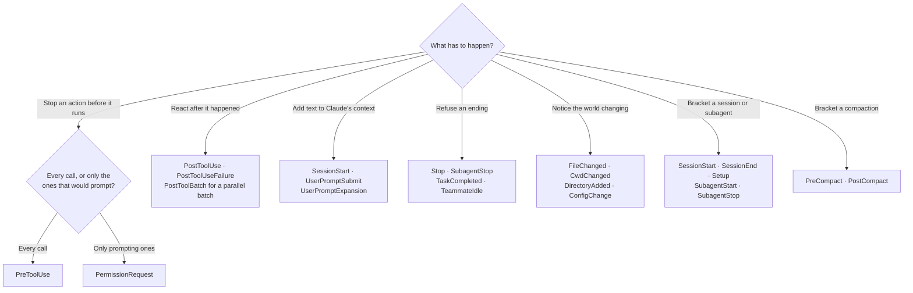

# Every hook event

Thirty-one events. For each one: when it fires, what its payload carries beyond the common fields, whether exit 2 stops anything, and — the part most often got wrong — **what its matcher is compared against**.

That last column varies per event and nothing tells you when you get it wrong. A `matcher: "Bash"` on `SessionStart` is compared against how the session started, matches none of `startup`/`resume`/`clear`/`compact`/`fork`, and the hook silently never fires. The symptom is a hook that appears correctly in `/hooks` and does nothing.

## Table of Contents

- [Which event?](#which-event)
- [Common input fields](#common-input-fields)
- [Matcher evaluation](#matcher-evaluation)
- [Session lifecycle](#session-lifecycle)
- [Turn lifecycle](#turn-lifecycle)
- [Around a tool call](#around-a-tool-call)
- [Subagents and tasks](#subagents-and-tasks)
- [Context and configuration](#context-and-configuration)
- [Display, notification, worktrees, elicitation](#display-notification-worktrees-elicitation)
- [Events with no matcher at all](#events-with-no-matcher-at-all)
- [Events where exit 2 does nothing](#events-where-exit-2-does-nothing)

## Which event?

Start from what has to happen. Thirty-one names do not sort themselves, and the branch structure is the whole content here, so it is a tree rather than a list.

The tree covers the twenty-one events people reach for; the tables below are the exhaustive set, and the remaining ten — `PermissionDenied`, `StopFailure`, `TaskCreated`, `Notification`, `MessageDisplay`, `WorktreeCreate`, `WorktreeRemove`, `Elicitation`, `ElicitationResult`, `InstructionsLoaded` — are reached by knowing they exist rather than by narrowing to them.

Having landed on a candidate, check three things in its row before writing any code: whether it takes a matcher at all, what that matcher is compared against, and whether exit 2 does anything there. Those three are where a wrong choice hides, because none of them fails loudly.

## Common input fields

Every event's payload carries these, on stdin for a `command` handler and as the POST body for an `http` one:

| Field | Notes |
|---|---|
| `session_id` | current session |
| `prompt_id` | UUID of the prompt being processed. Absent until the first user input |
| `transcript_path` | conversation JSONL. Written asynchronously, so it can lag the live turn — for the current turn's final text use `last_assistant_message` on `Stop`/`SubagentStop` instead |
| `cwd` | working directory when the hook fired |
| `permission_mode` | `default` \| `plan` \| `acceptEdits` \| `auto` \| `dontAsk` \| `bypassPermissions`. Not on every event. The mode shown as **Manual** arrives as `default` |
| `effort` | `{ level }` — present on events inside a tool-use context |
| `hook_event_name` | the event that fired |
| `agent_id`, `agent_type` | only when the hook fires inside a subagent, or under `--agent` |

`SessionStart` alone can receive a `model` field, and it is not guaranteed to be there. There is no `$CLAUDE_MODEL`.

## Matcher evaluation

The `matcher` is a string, and how it is interpreted depends on the characters in it rather than on any syntax you opt into:

| Matcher | Read as |
|---|---|
| `"*"`, `""`, or omitted | fires on every occurrence |
| only letters, digits, `_`, `-`, space, `,`, `\|` | exact string, or a `\|`/`,`-separated list of exact strings |
| anything else | JavaScript regular expression, **unanchored** |

Unanchored is the trap: `Edit.*` matches `NotebookEdit` too. Write `^Edit$` when you mean only `Edit`.

The same rule explains why `mcp__memory` matches nothing — it contains only exact-match characters, so it is compared as a whole string, and no tool is named exactly that. `mcp__memory__.*` is the working form. A plugin-bundled server needs the scoped name: `mcp__plugin_<plugin-name>_<server-name>__.*`.

`FileChanged` and `StopFailure` use a narrower exact set — letters, digits, `_` and `|` only — so a hyphen, space or comma in a matcher for those two puts it on the regex path.

Adding a `matcher` to an event that has no matcher support is **silently ignored**, not an error.

Comma separators need v2.1.191+; hyphens in the exact set need v2.1.195+, and before that a hyphenated name like `code-reviewer` was an unanchored regex that also matched `senior-code-reviewer`.

---

## Session lifecycle

| Event | Fires | Matcher compares against | Exit 2 |
|---|---|---|---|
| `SessionStart` | session begins or resumes | `source`: `startup`, `resume`, `clear`, `compact`, `fork` | stderr to the user only |
| `Setup` | `--init-only`, or `--init`/`--maintenance` under `-p` | `trigger`: `init`, `maintenance` | stderr to the user only |
| `SessionEnd` | session terminates | `reason`: `clear`, `resume`, `logout`, `prompt_input_exit`, `bypass_permissions_disabled`, `other` | stderr to the user only |

`SessionStart` payload adds `source`, sometimes `model`. Plain stdout is added to Claude's context, so a hook that only injects context can `echo` and skip JSON entirely. Its `hookSpecificOutput` also accepts `initialUserMessage`, `sessionTitle`, `watchPaths` (absolute paths to watch for `FileChanged`) and `reloadSkills` (re-scan skill directories after the hook, so a skill the hook installed is available this session).

`Setup` adds `trigger`. It does not fire on every launch, so a plugin that needs a dependency installed cannot rely on it alone — check on first use and install on miss.

`SessionEnd` adds `reason`. All `SessionEnd` hooks share a **1.5-second combined budget**, raised to match a longer per-hook `timeout` up to 60 seconds. Anything slower than that does not finish.

`SessionStart`, `Setup`, `CwdChanged` and `FileChanged` hooks get `CLAUDE_ENV_FILE`: append `export` lines to that path and they apply to subsequent Bash commands in the session.

## Turn lifecycle

| Event | Fires | Matcher compares against | Exit 2 |
|---|---|---|---|
| `UserPromptSubmit` | prompt submitted, before processing | *no matcher* | blocks the prompt and erases it |
| `UserPromptExpansion` | a typed command expands into a prompt | `command_name` | blocks the expansion |
| `Stop` | Claude finishes responding | *no matcher* | prevents stopping; conversation continues |
| `StopFailure` | turn ends on an API error | `error`: `rate_limit`, `overloaded`, `authentication_failed`, `oauth_org_not_allowed`, `billing_error`, `invalid_request`, `model_not_found`, `server_error`, `max_output_tokens`, `unknown` | ignored entirely |
| `TeammateIdle` | an agent-team teammate is about to idle | *no matcher* | keeps it working |

`UserPromptSubmit` adds `prompt`. Its default timeout drops to **30 seconds**. Plain stdout is added to context. It cannot replace the prompt — only inject `additionalContext` alongside it.

`UserPromptExpansion` adds `expansion_type`, `command_name`, `command_args`, `command_source`, `prompt`.

`Stop` adds `stop_hook_active`, `last_assistant_message`, `background_tasks`, `session_crons`. It fires whenever Claude finishes responding, not only at task completion, and not on a user interrupt. **Read `stop_hook_active` and exit 0 when it is true**, or the hook re-blocks its own continuation; Claude Code overrides a `Stop` hook after eight consecutive blocks, and `CLAUDE_CODE_STOP_HOOK_BLOCK_CAP` raises that.

`StopFailure` adds `error`, `error_details`, `last_assistant_message` — where, unlike `Stop`, that last field holds the API error string. Output and exit code are ignored; this is a notification event.

## Around a tool call

| Event | Fires | Matcher compares against | Exit 2 |
|---|---|---|---|
| `PreToolUse` | before a tool call executes | `tool_name` | blocks the call |
| `PermissionRequest` | a call needs a permission decision | `tool_name` | denies the permission |
| `PermissionDenied` | the auto-mode classifier denied a call | `tool_name` | ignored — the denial already happened |
| `PostToolUse` | after a call succeeds | `tool_name` | stderr shown to Claude; the tool already ran |
| `PostToolUseFailure` | after a call fails | `tool_name` | stderr shown to Claude |
| `PostToolBatch` | after a batch of parallel calls resolves | *no matcher* | stops the agentic loop before the next model call |

`PreToolUse` adds `tool_name`, `tool_input`, `tool_use_id`. It runs before any permission-mode check, in every mode including `bypassPermissions`. Files pulled in with `@` in a prompt do **not** produce a tool call, so no `PreToolUse` fires for them — use a `Read` deny rule for those paths instead. `EndConversation` skips both `PreToolUse` and `PostToolUse`.

`PermissionRequest` adds `permission_suggestions`, an array of the same shape as the `updatedPermissions` output — a hook can echo one back, which is equivalent to the user choosing "always allow". Under plain `-p` it only fires when the Agent SDK's `canUseTool` callback supplies the prompt; use `PreToolUse` for automated decisions in headless runs.

`PostToolUse` adds `tool_response`, `tool_use_id`, `duration_ms`. `PostToolUseFailure` adds `error`, `is_interrupt`, `duration_ms`. `PermissionDenied` adds `reason`, and its only output is `hookSpecificOutput.retry: true`, which tells the model it may try again.

`PostToolBatch` adds `tool_calls`, an array of the calls in the batch.

## Subagents and tasks

| Event | Fires | Matcher compares against | Exit 2 |
|---|---|---|---|
| `SubagentStart` | a subagent is spawned | `agent_type` | stderr to the user only, in the subagent's own transcript |
| `SubagentStop` | a subagent finishes | `agent_type` | prevents it stopping |
| `TaskCreated` | a task is created via `TaskCreate` | *no matcher* | rolls the creation back |
| `TaskCompleted` | a task is marked complete | *no matcher* | prevents completion |

`SubagentStart` adds `agent_id`, `agent_type`. `SubagentStop` adds `stop_hook_active`, `agent_transcript_path`, `last_assistant_message`. A plugin subagent reports a scoped type, so match it as `^my-plugin:reviewer$`.

Task events add `task_id`, `task_subject`, `task_description`, and `teammate_name`/`team_name` when part of an agent team.

## Context and configuration

| Event | Fires | Matcher compares against | Exit 2 |
|---|---|---|---|
| `PreCompact` | before compaction | `trigger`: `manual`, `auto` | blocks compaction |
| `PostCompact` | after compaction | `trigger`: `manual`, `auto` | ignored |
| `InstructionsLoaded` | a CLAUDE.md or `.claude/rules/*.md` loads | `load_reason`: `session_start`, `nested_traversal`, `path_glob_match`, `include`, `compact` | ignored |
| `ConfigChange` | a config file changes mid-session | `source`: `user_settings`, `project_settings`, `local_settings`, `policy_settings`, `skills` | blocks the change, except `policy_settings` |
| `CwdChanged` | the working directory changes | *no matcher* | ignored |
| `DirectoryAdded` | a directory is added mid-session | `source`: `slash_command`, `register_repo_root` | ignored |
| `FileChanged` | a watched file changes on disk | **literal filenames to watch** | ignored |

`PreCompact` adds `trigger`, `custom_instructions`. Blocking an automatic compaction that was triggered proactively means the conversation continues uncompacted; blocking one triggered to recover from a context-limit error surfaces that error instead.

`PostCompact` adds `compact_summary`. `InstructionsLoaded` adds `file_path`, `memory_type`, `load_reason`. `ConfigChange` adds `source`, `file_path`. `CwdChanged` adds `old_cwd`, `new_cwd`. `DirectoryAdded` adds `directory`, `source`.

`FileChanged` is the odd one: its matcher is not compared against a payload field, it is the **watch list**. The paths come from a `SessionStart` hook's `watchPaths` or from the matcher itself, and the payload carries `file_path` and `event`.

## Display, notification, worktrees, elicitation

| Event | Fires | Matcher compares against | Exit 2 |
|---|---|---|---|
| `Notification` | Claude Code sends a notification | `notification_type`: `permission_prompt`, `idle_prompt`, `auth_success`, `elicitation_dialog`, `elicitation_complete`, `elicitation_response`, `agent_needs_input`, `agent_completed` | stderr to the user only |
| `MessageDisplay` | while assistant text is displayed | *no matcher* | ignored; the original text is shown |
| `WorktreeCreate` | a worktree is being created | *no matcher* | **any** non-zero exit aborts creation |
| `WorktreeRemove` | a worktree is being removed | *no matcher* | logged in debug mode only |
| `Elicitation` | an MCP server asks the user for input | `mcp_server_name` | blocks |
| `ElicitationResult` | after the user answers an elicitation | `mcp_server_name` | blocks |

`Notification` adds `message`, `title`, `notification_type`. Hooks have no controlling terminal, so a desktop notification goes through the `terminalSequence` output field rather than a write to `/dev/tty`.

`MessageDisplay` adds `turn_id`, `message_id`, `index`, `final`, `delta`. Its default timeout drops to **10 seconds**. Its `displayContent` output changes only what is drawn on screen — the transcript and what Claude sees keep the original.

`WorktreeCreate` adds `name` and replaces the default git behaviour: a `command` handler prints the created worktree path on stdout, an `http` handler returns `hookSpecificOutput.worktreePath`. A failure or a missing path fails creation. `WorktreeRemove` adds `worktree_path`.

`Elicitation` adds `mcp_server_name`, `message`, `mode`, `requested_schema`; `ElicitationResult` adds `action`, `content`, `elicitation_id`. Both answer with `hookSpecificOutput.action` (`accept`/`decline`/`cancel`) and `content`.

---

## Events with no matcher at all

Adding one is silently ignored, so this list is worth reading rather than discovering:

`UserPromptSubmit`, `PostToolBatch`, `Stop`, `TeammateIdle`, `TaskCreated`, `TaskCompleted`, `WorktreeCreate`, `WorktreeRemove`, `CwdChanged`, `MessageDisplay`.

Narrow those with the `if` field instead, where the event is a tool event, or with a check at the top of the handler where it is not.

## Events where exit 2 does nothing

A guard written on one of these is decorative. If you need to stop something, you are on the wrong event:

`PermissionDenied`, `StopFailure`, `InstructionsLoaded`, `MessageDisplay`, `CwdChanged`, `DirectoryAdded`, `FileChanged`, `PostCompact`, `WorktreeRemove`.

And on `SessionStart`, `Setup`, `SubagentStart`, `Notification` and `SessionEnd`, exit 2 renders as a hook-error notice to the *user* — Claude never sees it and nothing is prevented.

`../scripts/test-hook.ts` asserts this: run your handler against the event you registered it on and it reports whether the exit code you chose does anything there.
