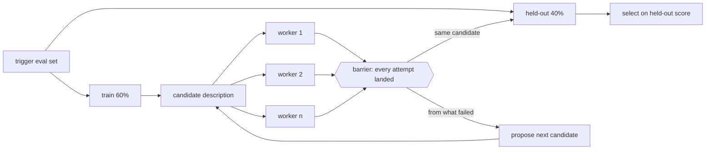

# Running the description optimization loop

The mechanics. What makes a description *good* is `description-writing.md` —
read that first if you have not, because this loop can only pick between the
candidates you give it. This file is how to measure one against another and let
the numbers pick.

The loop applies to any artifact whose routing is a model judgement — a skill, a
subagent's delegation, a slash command. `--target-type` selects which.

## Step 1: Generate the trigger eval queries

Twenty queries, roughly half should-trigger and half should-not, shaped
`[{"query": "...", "should_trigger": true}, ...]`. Derive them rather than
inventing them:

```bash
bun ../operations/synthesize-scenarios.ts --target <skill-dir> --out evals/trigger-eval.json
```

The script reads what the artifact *does* — body, references, scripts, examples,
and for an agent its system prompt and tool grant — and deliberately not the
description you are about to optimize.

That exclusion is the whole design constraint rather than a detail. Queries
generated from the description under test inherit its vocabulary and framing, so
every candidate scores well on the cases its own text suggested and the loop
certifies the description against itself. Worse, a capability the description
omits entirely generates no queries at all, so the omission — the most valuable
thing the loop could have found — is never penalised.

Hard negatives — the should-not-trigger half — come from three places, because a
hard negative has to be genuinely tempting or the set certifies everything:

- the artifact's stated non-goals, phrased in the *positive* vocabulary
- the adjacent capability one step outside the boundary — the request a
  reasonable person would assume this handles, and it does not
- the co-installed neighbours `--with-environment` finds, which is the most
  realistic source available, since those are the skills actually competing for
  the query on the user's machine

The script prints a capability inventory before it generates anything. Put that
in front of the user: they correct a misread before it costs an iteration, and a
capability they confirm but the description never mentions is a finding in its
own right, surfaced before a single query has run.

Use `--inventory-only` when you want that conversation first and the queries
after.

### What a good query looks like

Whether the script wrote them or you did, the set is only as good as the queries,
and this is the standard to hold them to before Step 2 puts them in front of the
user. `../../skills/skill-creator/examples/trigger-eval-set.json` is a finished set built to it.

Make them things a real user would actually type: concrete and specific, with
file paths, personal context about the user's job or situation, column names and
values, company names, URLs, a little backstory. Some in lowercase, some with
abbreviations or typos or casual speech. Mixed lengths. Aim at edge cases rather
than clear-cut ones.

Bad: `"Format this data"`, `"Extract text from PDF"`, `"Create a chart"`

Good: `"ok so my boss just sent me this xlsx file (its in my downloads, called
something like 'Q4 sales final FINAL v2.xlsx') and she wants me to add a column
that shows the profit margin as a percentage. The revenue is in column C and
costs are in column D i think"`

**Should-trigger (8-10):** chase coverage. Different phrasings of the same
intent, formal and casual. Cases where the user never names the skill or the file
type but clearly needs it. Uncommon uses. Cases where this skill competes with
another and should win.

**Should-not-trigger (8-10):** hard negatives only, to the standard in
`description-writing.md`, section "Your trigger eval set decides whether any of
this is visible". Anything with an obvious one-step first action is wasted
budget — it never reaches the point where skill selection happens, so it scores
zero for every candidate and discriminates nothing.

## Step 2: Review the set with the user

Get it signed off before running anything. Read `../../skills/skill-creator/assets/eval_review.html`,
replace `__EVAL_DATA_PLACEHOLDER__` with the JSON array — unquoted, it is a JS
variable assignment — and `__SKILL_NAME_PLACEHOLDER__` and
`__SKILL_DESCRIPTION_PLACEHOLDER__` with the artifact's name and current
description. Write it somewhere temporary and open it.

The user edits and toggles entries, then clicks "Export Eval Set", which
downloads to `~/Downloads/eval_set.json`. Check for a newer duplicate like
`eval_set (1).json` — the browser will not overwrite.

## Step 3: Run the loop

Tell the user it takes a while and that you will check in periodically. Save the
eval set to `evals/`, then launch it detached rather than babysitting it — the
script opens its own dashboard, so `nohup ... &` is complete:

```bash
nohup bun ../operations/optimize-description.ts \
  --eval-set <path-to-trigger-eval.json> \
  --target-path <path-to-skill-or-agent> \
  --target-type skill \
  --model <model-id-powering-this-session> \
  --max-iterations 5 \
  --verbose > /dev/null 2>&1 &
```

Read `running-detached.md` once the job is launched and you are wondering whether
it is alive: it covers the dashboard, what each row's pid answers, and why a
report and a status file can disagree.

Use the model ID from your own system prompt, so the triggering test matches what
the user actually experiences rather than a cheaper proxy.

What it does: splits the set 60% train / 40% held-out, evaluates the current
description at 3 runs per query for a stable trigger rate, asks Claude to propose
improvements from what failed, and re-evaluates each candidate on both splits, up
to `--max-iterations`. It opens an HTML report and returns JSON containing
`best_description`, **selected on the held-out score rather than the train
score** — a description tuned until it aces its own training queries has usually
just memorized them.

The shape is a fan-out to independent workers and a barrier, once per candidate,
which is the part that is hard to hold in prose and matters for reading progress:
nothing is comparable until every attempt in a round has landed.



Each worker holds one QUERY and runs its attempts in sequence; `--num-workers`
sets how many queries are in flight. The barrier is why a per-query verdict shown
mid-round can still flip — the trigger rate is not decided until the last attempt
for that query arrives.

Attempts are siblings inside one worker rather than independent pool items so that
a query can stop early: once its remaining attempts cannot move the verdict, they
are not run. That is where roughly a third of a sweep's calls go, since most useful
queries score 0/3 or 3/3 and are settled by their first two attempts. Ranking is
unaffected — iterations are compared on pass COUNTS, not on mean trigger rate — but
the per-query rates in `results.json` become rates over attempts actually run, and
`--no-early-stop` restores full-N ones. The scheduling is coarser than an
attempt-level pool, so set `--num-workers` at or above the query count when you can;
below it, a slow query can extend the tail.

### Target types

| `--target-type` | What counts as a trigger |
|---|---|
| `skill` (default) | the `Skill` tool, or a `Read` naming the skill |
| `agent` | the `Agent` tool invoked with a matching `subagent_type` |
| `command` | as `skill` |

The agent path installs the definition under a unique alias the same way the
skill path does, so no other artifact on the machine can absorb the match. The
alias is hyphen-suffixed rather than colon-scoped, because a subagent `name`
containing `:` is silently not loaded — a colon alias would install nothing and
score every query zero, which looks identical to a broken description.

## Reading the results

Claude only consults a skill for work it cannot easily handle alone, so a
one-step query like "read this PDF" may not trigger even when the description
matches perfectly. Simple queries make poor trigger queries in either direction.

What counts as a trigger is a consult at any point **before the first mutating
tool** — `Edit`, `Write` or `NotebookEdit`. Read-only reconnaissance beforehand
is expected rather than disqualifying: for a skill whose subject is a working
repository, the model often cannot tell whether the skill applies until it has
looked, so recon-then-consult is the same routing decision made a beat later with
more information. The first edit is the real negative signal — at that point the
model has committed to doing the job without consulting.

A description that is manually invoked only (`disable-model-invocation: true`)
has no description in context to optimize, so the loop does not apply. That is a
complete answer rather than a gap.

## Step 4: Apply the result

Take `best_description`, update the frontmatter, show the user before and after,
and report both scores — the train score as well as the held-out one, since the
gap between them is the honest measure of how much the loop overfitted.
