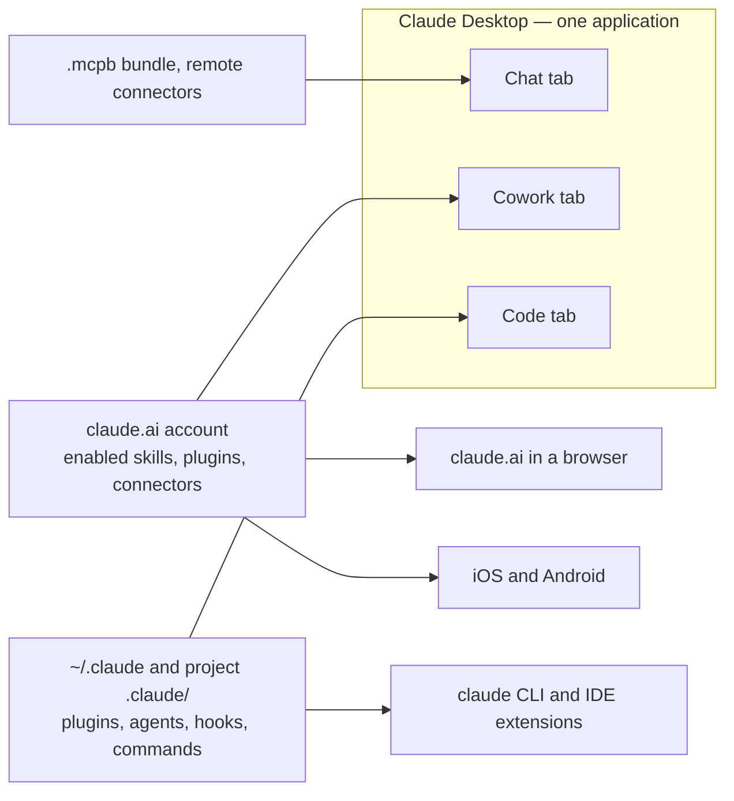

# Distribution targets

Where a thing you build can actually run, and what has to change to move it somewhere else.

The framing to fix first, because almost every portability mistake downstream comes from it: **there is no "Claude Desktop plugin" artifact.** Claude Desktop is one application with three tabs — Chat, Cowork, and Code. Plugins are the *Claude Code* format, and inside Desktop they are consumed by the **Cowork and Code tabs**. The **Chat tab does not use plugins at all**; its extension artifact is an **MCPB bundle**, which is a different file with a different manifest and a different install path.

So "does this work in Claude Desktop?" is not a question with one answer. It is three questions, and the useful reflex is to name the tab.

## Table of Contents

- [The surfaces, and what each consumes](#the-surfaces-and-what-each-consumes)
- [Compatibility matrix](#compatibility-matrix)
- [Looks portable but isn't](#looks-portable-but-isnt)
- [Reaching more than one surface](#reaching-more-than-one-surface)
- [MCPB, concretely](#mcpb-concretely)
- [Two directories, two submissions](#two-directories-two-submissions)
- [Managed and enterprise Desktop](#managed-and-enterprise-desktop)
- [Unverified](#unverified)
- [Where to go next](#where-to-go-next)

---

## The surfaces, and what each consumes

| Surface | What it is | What it loads |
|---|---|---|
| **Claude Code** — CLI and IDE extensions | the `claude` binary and its editor integrations | plugins (skills, agents, hooks, commands, MCP), `~/.claude/`, project `.claude/`, project `.mcp.json`; both remote and stdio MCP |
| **Desktop — Code tab** | Claude Code hosted in the desktop app | everything Claude Code loads, plus MCP servers declared in `claude_desktop_config.json` |
| **Desktop — Cowork tab** | agentic sessions bound to the claude.ai account | skills, plugins and connectors **enabled on the account**, synced at session start. It does **not** read `~/.claude` on the machine |
| **Desktop — Chat tab** | ordinary conversation in the desktop shell | MCPB bundles and remote connectors. Not plugins |
| **claude.ai** — web | the browser app | uploaded skills, remote connectors. No local process, so no stdio |
| **Mobile** — iOS and Android | the phone apps | remote connectors. No local process and no local files |
| **API** — Skills API, Agent SDK | programmatic | skills carrying only the portable frontmatter; MCP over HTTP |

Two consequences worth holding on to. A **remote (HTTP) MCP server reaches every one of those rows**, which is why remote is the recommended shape for anything meant to be widely used. A **local (stdio) server reaches only Claude Desktop and Claude Code** — never web, never mobile — and its absence there is silent rather than an error.

The part of the table that is genuinely a picture is where each surface gets its contents from, because two tabs of the same application read two different sources:



Nothing crosses between the two left-hand sources. That is the whole explanation for "I installed the plugin and Cowork cannot see it" and for "my skill works on my laptop but not on my phone".

---

## Compatibility matrix

`✓` runs · `—` not available · `⚠` runs with a change, named in the last column · `?` unverified, see the section at the end.

| Artifact | Claude Code | Desktop Code | Desktop Cowork | Desktop Chat | Web | Mobile | To move it |
|---|---|---|---|---|---|---|---|
| Skill, portable frontmatter | ✓ | ✓ | ✓ | ? | ✓ | ✓ | Enable on the account for Cowork and web; upload as a ZIP with the skill directory nested inside |
| Skill, Claude Code frontmatter | ✓ | ✓ | ⚠ | ? | ⚠ | ⚠ | Strip to the six standard keys. An extra key is a hard error, not an ignored field |
| Skill body using injection or `${CLAUDE_SKILL_DIR}` | ✓ | ✓ | — | — | — | — | Rewrite the step as an instruction; the placeholder does nothing elsewhere, without complaining |
| Plugin (the whole bundle) | ✓ | ✓ | ✓ | — | — | — | Nothing, for the three that support it. For Chat there is no port — build an MCPB instead |
| Subagent | ✓ | ✓ | ✓ | — | — | — | Only travels bundled in a plugin. No standalone install path off Claude Code |
| Hook | ✓ | ✓ | ✓ | — | — | — | Same. Hooks are a Claude Code concept end to end |
| Slash command | ✓ | ✓ | ✓ | — | — | — | Same. Outside Claude Code there is no `/name` entry point to install |
| MCP server, remote HTTP | ✓ | ✓ | ✓ | ✓ | ✓ | ✓ | Add OAuth if it authenticates. This is the only shape that reaches all six |
| MCP server, local stdio | ✓ | ✓ | ✓ | ✓ | — | — | Host it and switch `type` to `http`, or accept that web and mobile never see it |
| MCPB bundle (`.mcpb`) | — | — | — | ✓ | — | — | Not installable into Claude Code — see the unverified note below |

---

## Looks portable but isn't

This is where authors lose time, so each of these is worth knowing before the first file is written rather than after the first rejection.

**A skill with rich frontmatter fails loudly at the far end, not quietly.** Outside Claude Code — claude.ai upload, the Skills API, Anthropic's own packaging script — exactly six keys are permitted: `name`, `description`, `license`, `compatibility`, `metadata`, `allowed-tools`. A seventh is a hard error:

```text
Unexpected key(s) in SKILL.md frontmatter: argument-hint. Allowed properties are: allowed-tools, compatibility, description, license, metadata, name
```

That is a better failure than a silent ignore, because it happens at packaging time. `bun ../validate/validate.ts --target-type skill <dir>` without `--extended` is the same gate applied earlier still.

**The description length limit is not one number.** The Agent Skills spec allows 1024 characters; Claude Code truncates `description` plus `when_to_use` at 1,536 combined; claude.ai caps `description` at **200**. A description written to the Claude Code budget will usually exceed the claude.ai cap, so the trip to claude.ai is a rewrite of the highest-leverage field in the file rather than a copy.

**"Plugins work in Claude Desktop" is two-thirds true.** Cowork and the Code tab load them. Chat does not. If the user's picture of the destination is the Chat tab, a plugin is the wrong artifact and no amount of manifest work will fix it.

**Cowork does not see a plugin you installed from the CLI.** Cowork syncs what is enabled on the claude.ai account at session start; the Code tab reads `~/.claude/` on the machine. Same application, two different sources, and a plugin installed one way is invisible the other way.

**A stdio server is absent on web and mobile with no error.** Nothing reports a missing server; the tools simply are not in the model's list, and the model does what it can without them. The symptom the user reports is "Claude got it wrong on my phone", which points at the model rather than at the transport.

**A skill that lives only in `~/.claude/skills/` is reported as not found when a routine invokes it**, because each routine run is a fresh remote session with no access to the machine. Desktop *scheduled tasks* are the exception worth knowing: they run locally, so they do load local skills.

**claude.ai upload wants the skill directory nested inside the ZIP**, not the skill's files at the zip root. Zipping from inside the directory produces the second shape, which is the wrong one — zip the directory, not its contents.

**`claude_desktop_config.json` is not deprecated**, despite how often it is described that way. It lives at `~/Library/Application Support/Claude/claude_desktop_config.json` on macOS and `%APPDATA%\Claude\claude_desktop_config.json` on Windows, and its schema is the familiar one:

```json
{ "mcpServers": { "<name>": { "command": "…", "args": ["…"], "env": {} } } }
```

The Desktop Code tab loads servers from it *alongside* `~/.claude.json` and project `.mcp.json`, and **it wins on a name collision** — which makes it a real source to check when a server resolves to something you did not write. The standalone CLI does not read it at all; `claude mcp add-from-claude-desktop` imports the entries instead.

---

## Reaching more than one surface

Ranked by what each actually buys, rather than by effort.

**1. Ship two things: a remote MCP server with OAuth, and a plugin with skills that wraps it.** This is Anthropic's stated recommendation for reaching everything, and it works because the two artifacts compose rather than duplicate:

> "A plugin references a remote MCP server by URL. If a user has both your directory connector and your plugin installed, Claude sees one set of tools."

The server reaches web, mobile, Chat, Cowork, Code and the CLI. The plugin adds the skills, agents and hooks that make the tools usable well, on the three surfaces that can load a plugin. The other half of the reason is distribution: **skills cannot be submitted to the directory on their own** — a plugin is the mechanism by which a skill gets published at all.

**2. A remote MCP server alone.** If the value is entirely in the tools, this is the cheapest thing that reaches every surface. Everything a plugin would have added becomes tool descriptions, which is a real constraint — the routing guidance you would have put in a skill body has nowhere else to go.

**3. A plugin and an MCPB built from one repository.** For a team that genuinely needs the Chat tab and Claude Code, and does not want a hosted service. Two artifacts, two manifests, one source tree. Anthropic publishes **no** canonical layout for this, so a repo carrying `manifest.json` at the root and `.claude-plugin/plugin.json` beside it is a reasonable composition of the two specs and your own design decision — not something to present to a user as the documented way.

**4. One manifest that doubles as both.** Documented, and narrower than it looks:

> "Claude Code ignores top-level fields it does not recognize… This makes it practical to maintain one manifest that doubles as a VS Code or Cursor extension manifest, an npm package.json, or an MCPB/DXT bundle manifest."

The caveat that decides whether you can use it: **`claude plugin validate --strict` promotes unrecognized fields to errors**, so a merged manifest passes an ordinary validation and fails a strict CI gate. Either drop `--strict` for that repo — losing the version warning and everything else strict mode catches — or keep the manifests separate.

**5. A trimmed skill for claude.ai, alongside the real one.** When the same knowledge should exist on web and mobile, two artifacts beat one weakened file: a six-field, injection-free version for upload, and the Claude Code version with its extensions intact. A skill designed down to the portable subset is worse in Claude Code and no better anywhere else.

---

## MCPB, concretely

MCPB (`.mcpb`) is the renamed DXT (`.dxt`). Existing `.dxt` files still work; `.mcpb` is the current name. The file is a zip containing a `manifest.json` and a local stdio MCP server — which is also its boundary: an MCPB runs a process on the user's machine, so it is a Desktop artifact and cannot reach web or mobile.

`manifest_version` is `"0.3"`. Required: `manifest_version`, `name`, `version`, `description`, `author` (an object, with `name` required), and `server`.

```json
{
  "manifest_version": "0.3",
  "name": "acme-tracker",
  "version": "0.1.0",
  "description": "Reads and updates Acme issues",
  "author": { "name": "Acme Labs" },
  "server": {
    "type": "binary",
    "entry_point": "server/acme-tracker",
    "mcp_config": { "command": "…", "args": [], "env": {} }
  }
}
```

`mcp_config` carries `command`, `args`, `env` and an optional `platform_overrides`. The `command` is elided above rather than invented: how a bundle addresses a path inside itself is a detail worth taking from a generated manifest instead of from prose, and `bunx @anthropic-ai/mcpb init` writes one.

`server.type` accepts `node`, `python`, `binary` and `uv`. **This plugin's recommended route is `binary`**, produced by `bun build --compile`: it ships one self-contained executable, so the user needs no runtime and a whole class of install failure — the machine not having the interpreter the bundle expects — stops existing. The cost is real and worth planning for rather than discovering: a compiled binary is per-platform, so you build one per target and use `mcp_config.platform_overrides` alongside `compatibility.platforms` to point each platform at its own file.

Optional fields worth knowing: `display_name`, `long_description`, `icons`, `tools`, `prompts`, `user_config`, `compatibility` (a `claude_desktop` semver range, `platforms`, `runtimes`), `privacy_policies`, `repository`, `license`.

`user_config` is the one that changes the user's experience most: Claude Desktop **auto-generates a settings UI from it**, so a bundle that declares its configuration never needs a README telling someone which environment variable to export. Types are `string` (with `sensitive` for secrets), `number` (with `min`/`max`), `boolean`, `directory`, and `file` — the last two support `multiple`.

Tooling is `@anthropic-ai/mcpb`, with subcommands `init`, `validate`, `pack`, `sign`, `verify`, `info` and `unsign`:

```bash
bunx @anthropic-ai/mcpb init
bunx @anthropic-ai/mcpb validate manifest.json
bunx @anthropic-ai/mcpb pack . dist/acme-tracker.mcpb
```

A user installs one by double-clicking it, dragging it onto the app, or through Settings → Extensions → Advanced → Install Extension.

---

## Two directories, two submissions

They are separate catalogues with separate processes, and confusing them costs a rejection cycle.

- **The Connectors Directory** (claude.com/connectors) takes remote MCP servers, MCPB bundles and MCP Apps. MCPB submissions go through a separate form from remote servers.
- **The plugin directory** (claude.com/plugins-for/cowork) takes plugins.

Submission requirements that reject rather than warn: every tool needs a `title`, and the applicable `readOnlyHint` / `destructiveHint` annotations; an authenticated service needs OAuth 2.0; and a **missing privacy policy is an immediate rejection**. That last one is worth settling before writing the tools, because it is a document rather than a code change and it is the one nobody has ready.

---

## Managed and enterprise Desktop

When an organization administers Desktop, precedence runs **`managedMcpServers` (admin) > organization plugins (admin) > user extensions**. A user-installed extension cannot override an admin-supplied server, which is the intended behaviour and also the explanation for "my connector stopped working after IT rolled something out".

An org plugin marketplace is a git repository containing `.claude-plugin/marketplace.json` — the same format Claude Code uses, so one marketplace repo serves both. Where `auto_install` or `required` is set, the `ref` has to pin a **full 40-character commit SHA**; a branch name or a short SHA is not accepted, because an auto-installed plugin that can move underneath the fleet is not something an administrator can approve once.

Org plugins are installed to `/Library/Application Support/Claude/org-plugins/` on macOS and `C:\Program Files\Claude\org-plugins\` on Windows.

One field-level difference to carry into a plugin's `.mcp.json` as Desktop reads it: entries use **`type`**, not `transport`, and only `url`, `headers` and `oauth` are read — **`headersHelper` is not read from that file**. A plugin relying on a computed header works in Claude Code and comes up unauthenticated there, which is a confusing failure because the entry is otherwise identical.

---

## Unverified

Everything above is checked against current documentation. These are not, and are listed rather than guessed at because a wrong fact in this file is worse than a gap:

- **Where installed `.mcpb` files land on disk.** Not published anywhere found.
- **Whether claude.ai accepts a `.skill` file directly.** The documentation says ZIP; Anthropic's `package_skill.py` emits `.skill`. Both cannot be the whole story and which one is current was not established.
- **Whether `.skill` is an official format name at all.** It appears as an output filename in one Anthropic script and is absent from the Agent Skills specification.
- **The Linux path for `claude_desktop_config.json`.** macOS and Windows are published; Linux is not.
- **Whether `.mcpb` install works in the Linux beta.**
- **Any documented way to install an `.mcpb` into Claude Code.** The matrix above marks it unavailable on that basis, which is an absence of documentation rather than a documented prohibition.
- **MCPB size limits.** No figure found; do not quote one.
- **Whether skills enabled on the claude.ai account appear in the Desktop Chat tab specifically.** The Chat tab's use of MCPB and connectors is established; its skill behaviour was not separately confirmed.

---

## Where to go next

- Read `skill-frontmatter.md` when the matrix says a skill needs its frontmatter trimmed and you are deciding what to drop — it has the six-field portable subset and what each extension's absence actually costs.
- Read `environments.md` when the question turns out to be where you are *authoring* from rather than where the artifact ships; the two get conflated constantly and they have different answers.
- Read `plugin-skills.md` before building the plugin the matrix points you at: layout, the manifest, and `userConfig` for anything the user must supply.
