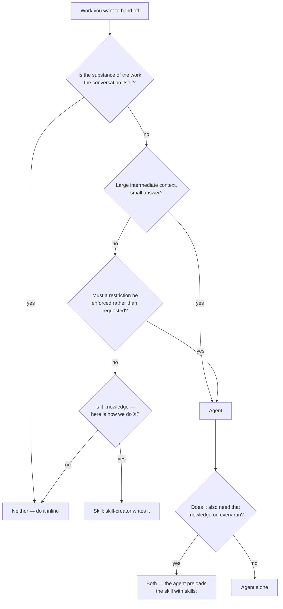

# Delegation: how an agent gets reached, and why it usually is not

An agent's body can be flawless and never run. Everything in this file is about the decision that happens before the body exists as far as Claude is concerned.

## Table of Contents

- [Agent, skill, both, or neither](#agent-skill-both-or-neither)
- [Where the decision is made](#where-the-decision-is-made)
- [The three invocation paths](#the-three-invocation-paths)
- [Discovery precedence](#discovery-precedence)
- [Plugin subfolder scoping](#plugin-subfolder-scoping)
- ["Use proactively"](#use-proactively)
- [The `<example>` / `<commentary>` convention](#the-example--commentary-convention)
- [Why a vague description loses to a specific sibling](#why-a-vague-description-loses-to-a-specific-sibling)

---

## Agent, skill, both, or neither

Four questions, and the order matters — the first one disqualifies more candidates than the other three together.



The first branch is the one authors skip. An agent sees the prompt it was handed and nothing else, so work whose substance is four turns of accumulated constraint arrives at the agent stripped of most of what made it answerable. The agent then performs correctly against the wrong brief, and nothing in the transcript looks wrong.

The `J` outcome is underused. Two agents that keep needing the same explanation are two copies of a skill that has not been written yet, and the copies drift.

---

## Where the decision is made

When the decision is taken Claude has the `name` and `description` of every installed agent, alongside the name and description of every installed skill. Nothing else. The system prompt body, the tool grant, the bundled files — none of that is visible until after the decision to delegate has been taken.

So the description is not documentation of the agent. It is the agent, as far as delegation is concerned.

The competitor set is wider than authors expect. An agent competes with:

- **Other agents**, including ones the user installed from somewhere else.
- **Skills.** A skill that absorbs the query is a delegation that did not happen, and the transcript shows a perfectly reasonable outcome — the work got done, just not by the agent you wrote.
- **The model doing the work inline**, which is the most common outcome by a wide margin. Claude reaches for a subagent when the work looks like it needs a separate context: long, exploratory, parallel, or needing a different posture. A query with an obvious one-step first action gets answered directly no matter how well the description matches.

That last point has a practical consequence for measurement: simple queries make poor evals in either direction, because they never reach the delegation decision at all. `../../../shared/references/description-writing.md` has the measurements behind that, made for skills, and the mechanism is the same one.

---

## The three invocation paths

Three ways an agent starts. Only the first is *delegation* — Claude choosing the agent from its description — and the other two bypass the description entirely, which is why "the agent works when I invoke it by name" says nothing about whether it is ever delegated to.

**Automatic delegation.** Claude decides, from the description. This is the path the description exists for and the only one worth measuring.

**`@agent-<name>`** in a user message forces a specific agent. The description is irrelevant here; the *name* is the whole interface. Which is a reason to keep names short, guessable and free of internal jargon — a user typing `@agent-` and reading the completion list is choosing on the name alone.

**`--agent <name>`** at launch makes the agent the main session rather than a delegate. The description does not participate. `initialPrompt` does, and this is the only path where it means anything.

There is a fourth path in practice: **an agent delegating to another agent** through `Task`. Mechanically this is automatic delegation with a different caller, so the same description rules apply — but the caller is a model working from a brief rather than a person with context, which makes a description that depends on conversational nuance work worse here than in the main thread.

---

## Discovery precedence

When the same agent name exists in more than one place, the highest wins outright. There is no merging.

| Priority | Source |
|---|---|
| 1 (highest) | Managed settings |
| 2 | The `--agents` CLI flag |
| 3 | `.claude/agents/` — project |
| 4 | `~/.claude/agents/` — user |
| 5 (lowest) | Plugin `agents/` |

Two consequences worth designing around.

**A plugin agent is the easiest thing in the system to override**, sitting at the bottom. That is usually what you want: a team can drop a `.claude/agents/schema-reviewer.md` into their repository and take over the name without touching the plugin. If you are shipping a plugin agent you expect people to customize, say so in its body — the override is a feature, and an author who does not know about it will fork the plugin instead.

**A shadowed agent is invisible, not broken.** Nothing announces that a project file has taken over a plugin name; the wrong agent simply runs. `/doctor` reports duplicate agent names, which is the fastest way to find this when an agent behaves like a version you do not recognise.

---

## Plugin subfolder scoping

A subfolder under a plugin's `agents/` directory becomes part of the agent's scoped identifier:

```text
my-plugin/
└── agents/
    ├── changelog.md            → my-plugin:changelog
    └── review/
        └── security.md         → my-plugin:review:security
```

This is why `name` may not contain `:` — the character is the scope separator, and a definition that uses it is silently not loaded.

Subfolders earn their place once a plugin ships enough agents that the flat list stops reading well. Below about four, they add a level of path for nothing. Above it, `review:security` and `review:performance` tell a user something that `security-reviewer` and `performance-reviewer` only imply.

---

## "Use proactively"

Including "use proactively" (or "proactively use this agent when…") in a description encourages Claude to delegate without being asked. It is the one piece of universal-quantifier phrasing that is sanctioned rather than penalized here.

It is still pushiness, and it still costs what pushiness costs: a higher true-positive rate bought with a disproportionate rise in false positives, and pressure on co-installed siblings competing for the same vocabulary.

So use it where the agent's value genuinely depends on firing unasked — a reviewer that should run after an edit is worth much less if the user has to remember to ask for it — and not as a default lever for an agent that under-triggers. When an agent under-triggers, the first thing to check is whether the description names a deliverable, because a topic-matching description loses to a specific sibling regardless of how proactively it asks to be used.

---

## The `<example>` / `<commentary>` convention

Widely-shipped agents carry two or three blocks inside the description showing the delegation decision as a short transcript:

```text
<example>
Context: User just finished authoring a new skill.
user: "I've created a PDF processing skill"
assistant: "I'll use the skill-reviewer agent to review it against our conventions before you package it."
<commentary>
A skill was just created. Review it now, while the author still has context,
rather than after packaging.
</commentary>
</example>
```

**This is idiomatic, not documented spec.** Nothing parses those tags; they are prose inside the description field. An agent without them loads and delegates perfectly well. They are worth writing anyway, because they are few-shot demonstrations of the delegation decision placed in the only text that is read when that decision is made.

The length guidance for descriptions does not apply to them. A description that is mostly examples by character count is normal for an agent.

What makes a block earn its space:

- **The `Context:` line carries the situation, not the request.** "User just finished authoring a new skill" is a state of the world; "User wants a review" is the request restated, and teaches nothing the description did not already say.
- **The `user:` line is phrased the way a user actually types**, including the version that never says the agent's name or the artifact's. That is the case the plain description handles worst.
- **The `<commentary>` explains why the work is delegated**, not what the agent does. "Non-triggering is nearly always a description defect, so audit the description" is a delegation rationale. "This agent checks descriptions" is a repeat of the first sentence.
- **The set spans different shapes of trigger.** Three blocks that are three phrasings of the same situation demonstrate one thing three times. One explicit request, one implicit situation, one edge case is a better spend of the same characters.

---

## Why a vague description loses to a specific sibling

Consider two agents installed together.

> **`code-reviewer`** — Reviews code for quality and best practices. Use after writing or changing code.

> **`schema-reviewer`** — Reviews a database migration for lock risk, backfill cost and rollback safety, and returns findings with a severity and a concrete remediation for each. Use when a migration has just been written or changed, or before one is applied to a production database. Do not use for application code that merely queries the schema — that is an ordinary code review.

Now: *"I just added a migration that puts a NOT NULL column on the orders table, can you look before I merge?"*

`schema-reviewer` wins, and the reason is mechanical rather than aesthetic. The query's content words — migration, column, table — appear in its description and not in the other's. `code-reviewer` matches only through the general category "code", and a general category match loses to a specific one.

The part that surprises people is the second-order effect. `code-reviewer` does not only lose migration reviews. Its description gives Claude no way to know what it is *for*, so every sibling that names something specific carves a piece out of it, and what is left is whatever no one else claimed. A vague agent's effective trigger rate falls as its neighbourhood fills up, and nothing reports the loss — the work still gets done, by someone else. `../../../shared/references/description-writing.md` measures this effect for skills and finds it substantial.

The fix is not to make `code-reviewer` pushier. It is to name what it produces, and to exclude the sibling's territory in the sibling's own vocabulary — "Do not use for database migrations; the schema-reviewer agent covers lock risk and rollback safety." A negative built from words that never appear in the positive clauses excludes nothing, because the near-miss arrives phrased in the positive vocabulary.

