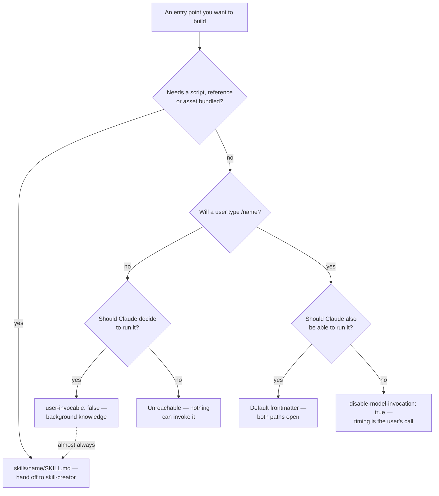

# Frontmatter for an invocation-first entry point

The same field set governs `.claude/commands/deploy.md` and `.claude/skills/deploy/SKILL.md`. This file covers those fields as they matter to something a person invokes by typing `/name` — which reorders them, because the fields that decide *who may invoke it* and *what the user has to type* are the ones a command author actually reasons about.

Read `../../../shared/references/portability.md` instead of this one when the question is *portability* rather than *which field to set*: it carries the two-layer standard-versus-extension split, which extensions fail open when another runtime ignores them, and why `skills-ref validate` rejects a working Claude Code skill by design. The two files partition rather than overlap — that one is organised by what survives leaving Claude Code, this one by what a command author reasons about in order. The single place they meet is the six-field restriction at the end of this file, restated because a command author hits it from the packaging direction and needs the exact message there.

All fields are optional. Only `description` is recommended.

Booleans accept `yes`, `no`, `on`, `off`, `1`, `0` in any letter case as well as `true` and `false`, from v2.1.218. Earlier versions recognise only `true` and `false`, and the standard's own parser reads `yes` as the string `"yes"` — so write `true` and `false` and the question never arises.

---

## Scope markers

| Marker | Meaning |
|---|---|
| **Both** | Works the same standalone and inside a plugin |
| **Plugin only** | Only meaningful once the file ships inside a plugin |
| **Standalone only** | Only meaningful outside a plugin, or ignored when bundled |

An honest observation before the tables: **almost every field here is Both.** This is not the situation on the agent side, where `permissionMode`, `mcpServers` and `hooks` are silently ignored for plugin subagents and an author who sets them gets no error at all. Skill and command frontmatter has essentially no plugin/standalone divergence, and there is no field in this set that is Standalone only. Exactly one field changes meaning between the two scopes — `name` — which is worth knowing precisely because it is the only one.

The scope that does bite is the third one, and it is not in the table above: **outside Claude Code**, the permitted field set collapses to six and everything else is a hard error. That section is at the end.

---

## Identity and discovery

### `name` — **Both**, with different meanings

*Value:* a kebab-case string. *Default:* the directory or file name.

What it does depends on where the file lives, and this is the one genuine plugin/standalone split:

| Location | What decides the command name |
|---|---|
| `.claude/skills/deploy/SKILL.md` | the **directory** → `/deploy`. `name` is only a display label |
| `.claude/commands/deploy.md` | the **file name** → `/deploy`. `name` is only a display label |
| `my-plugin/skills/review/SKILL.md` | frontmatter `name`, or the directory, namespaced → `/my-plugin:review`, or `/my-plugin:fancy` with `name: fancy` |
| `my-plugin/SKILL.md` (plugin root) | frontmatter `name` supplies the whole final segment; the plugin directory name is the fallback |

*When it earns its place:* always, and always identical to the directory or file name. Standalone, a divergent `name` produces a file invoked by one name and listed under another, which is a bug report waiting to happen and which the standard's validator rejects outright. In a plugin it is load-bearing, so a mismatch is not cosmetic — it changes the command.

For a plugin skill, the bare `/fancy` also works unless something else already claims it. A skill and a command with the same name are not an error: the skill wins.

### `description` — **Both**

*Value:* a string. *Default:* the first paragraph of the body.

For a model-invocable command this is the entire trigger surface and deserves the treatment in `../../../shared/references/description-writing.md`: name the artifact produced rather than the topic, and exclude at least one same-domain, different-deliverable case.

For a command with `disable-model-invocation: true` the calculus inverts. The description is not in context at all, so it cannot trigger, cannot be truncated, and cannot compete with a sibling. It is documentation for the human reading `/help`. Write it for them: what this does, what it will change, and what it needs typed after it.

*When it earns its place:* always. Even the manual-only case needs a line in the menu, and "if omitted, the first paragraph is used" tends to surface a sentence that was written as an opening, not as a summary.

*Budget:* `description` and `when_to_use` combined are truncated at 1,536 characters in the skill listing, and the listing as a whole has a budget scaling at 1% of the model's context window. When it overflows, Claude Code drops descriptions starting with the least-invoked skills. Put the key use case first.

### `when_to_use` — **Both**

*Value:* a string. *Default:* absent.

Appended to `description` in the listing and counted against the same 1,536-character cap. It buys separation — capability in one field, trigger phrasing in the other — not extra budget.

*When it earns its place:* when the trigger phrasing is long enough that mixing it into `description` obscures what the command produces. Pointless on a manual-only command, where neither field reaches the listing.

---

## The invocation contract

### `argument-hint` — **Both**

*Value:* a string, conventionally bracketed slots. *Default:* absent.

Shown during `/` autocomplete, so it is the only documentation that arrives before the user commits to a syntax.

```yaml
argument-hint: "[pr-number] [reviewer]"
```

*When it earns its place:* whenever the file reads any argument. A command that takes input and offers no hint makes every first use a guess. Name the slots in the order the body consumes them, in the user's vocabulary — `[pr-number]`, not `[arg0]` and not `[string]`. Put optional slots last and mark them. Keep it in sync with the body; a stale hint is worse than none, because it is believed.

### `arguments` — **Both**

*Value:* a space-separated string or a YAML list. *Default:* absent.

```yaml
arguments: [issue, branch]
arguments: issue branch
```

Declares names for positional arguments, usable as `$issue` and `$branch` in the body. Names map to positions in declaration order — they are labels for positions, not keyword arguments, so the user still types values in order.

*When it earns its place:* once the file is long enough that a bare index stops being self-explanatory, or once a value appears in several paragraphs. A four-line command with one argument is clearer with `$ARGUMENTS`. Note the failure difference before choosing: a missing named argument expands to nothing and leaves a hole in a sentence, while a missing index survives as literal text. Read `arguments.md` when you are about to declare the list, for what each form renders to when the user omits a slot.

### `disable-model-invocation` — **Both**

*Value:* boolean. *Default:* `false`.

Set `true` and only a typed `/name` invokes the file. It also stops the skill being preloaded into subagents, and — from v2.1.196 — stops it running when a scheduled task fires with it as the prompt.

*When it earns its place:* when the timing of the effects should be the user's decision rather than an inference. Deploys, commits, releases, anything that spends money, sends a message, or touches production. If Claude attempts it anyway, Claude Code blocks the call and instructs it not to reproduce the steps another way, so the visible result is a suggestion to run the command yourself.

The consequence people miss: the description leaves the context window entirely. That is a saving and a constraint — the command costs nothing in the listing, and no description work will ever make it fire.

*Portability:* fail-open. A runtime that does not implement it loads the file without the restriction, and other editors do scan `.claude/skills/`. Do not let it be the only thing standing between a user and a destructive action; put the guardrail in the body and in permission settings too.

### `user-invocable` — **Both**

*Value:* boolean. *Default:* `true`.

Set `false` to hide the file from the `/` menu, leaving Claude as the only caller. For background knowledge that is not an action — a `legacy-billing-context` file that explains how an old system behaves.

*When it earns its place:* rarely, in a command. If you are reaching for it, the artifact is probably not invocation-first any more and `skill-creator` is the better fit.

### The four combinations

| Frontmatter | User types `/name` | Claude may invoke | Description in context |
|---|---|---|---|
| *(default)* | yes | yes | always |
| `disable-model-invocation: true` | yes | no | no |
| `user-invocable: false` | no | yes | always |
| both | **no** | **no** | no |

Both set leaves nothing that can reach the file. Nothing rejects it at load; it simply never runs.

### Choosing the layout and the invocation rule together

They are two independent axes and they are usually decided in one sitting, because the answer to the second often changes the answer to the first.



The dotted edge is the one worth arguing with. Arriving at `user-invocable: false` means nothing about the artifact is invocation-first any more: it is knowledge Claude reaches for, which is a skill, and the `/name` machinery in this file buys it nothing. The `G` outcome is the same mistake made twice — it loads, it validates, and nothing can ever reach it.

---

## What it may do

### `allowed-tools` — **Both**

*Value:* a space- or comma-separated string, or a YAML list. Permission-rule syntax. *Default:* absent.

Grants permission-free use of the listed tools **for the turn that invoked the file only**. The grant clears on the next user message even though the content stays in context; invoking again re-applies it. It does not restrict anything — every other tool remains callable under the usual permission settings.

```yaml
allowed-tools: Bash(git add *) Bash(git commit *) Bash(git status *)
```

*When it earns its place:* when the command's whole job is a known sequence of shell calls and a prompt on each one turns a one-keystroke action into five. Grant the narrowest patterns that cover the sequence — `Bash(git commit *)`, not `Bash(*)`.

`${CLAUDE_SKILL_DIR}` and `${CLAUDE_PROJECT_DIR}` are substituted inside `Bash(...)` rules here as well as in the body, which is how a bundled script runs unprompted: the rule and the instruction are written from the same variable and cannot drift apart. Read `arguments.md` when you are writing that rule, for the literal spelling of the two variables and the grant beside the instruction that uses it.

*Trust note:* for a project's `.claude/`, this takes effect once the workspace trust dialog is accepted. A checked-in command can grant itself broad tool access, so reviewing them is part of trusting a repository.

### `disallowed-tools` — **Both**

*Value:* same forms. *Default:* absent.

Removes tools from the pool while the file is active, clearing on the next user message. It cannot remove `EndConversation` while any other tool remains.

*When it earns its place:* on a command meant to run without interruption — removing `AskUserQuestion` from a batch loop, for instance. For a manually invoked command the user is usually right there, so the case is weaker than it looks.

*Portability:* fail-open, like `disable-model-invocation`.

---

## How it runs

### `model` — **Both**

*Value:* anything `/model` accepts, a full model ID, or `inherit`. *Default:* the session model.

Applies for the rest of the current turn and is not saved to settings. A value excluded by an organization's `availableModels` allowlist is ignored and the session keeps its model. Under `context: fork`, it sets the forked subagent's model instead.

*When it earns its place:* when the command's work has a different shape from the conversation around it — a cheap mechanical command in an expensive session, or a hard analysis command in a cheap one. Otherwise inheriting is right and pinning is a maintenance liability as model names change.

### `effort` — **Both**

*Value:* `low`, `medium`, `high`, `xhigh`, `max`; available levels depend on the model. *Default:* inherited.

*When it earns its place:* same reasoning as `model`, one dial down and less brittle, because the level names outlive individual models. The body can also read the active level through the effort substitution and adapt its instructions.

### `context`, `agent`, `background` — **Both**

`context: fork` runs the file in a forked subagent, with the rendered content as its prompt and no access to the conversation history. `agent` picks the subagent type. `background: false` (v2.1.218+) waits for the result in the invoking turn instead of backgrounding it.

*When they earn their place:* when the command produces a large intermediate — reading a whole diff, crawling a directory — and only the conclusion belongs in the main conversation. The cost is the isolation: a forked command cannot see what the user was just talking about, so it needs everything it requires in its arguments and its injected context.

One interaction specific to commands: a forked command ends command stacking. It cannot be chained after another in the same message.

### `shell` — **Both**

*Value:* `bash` (default) or `powershell`.

Chooses the interpreter for load-time injections in this file. `powershell` applies where the PowerShell tool is enabled — by default on Windows without Git Bash, elsewhere with `CLAUDE_CODE_USE_POWERSHELL_TOOL=1`.

*When it earns its place:* when the injected commands are written in PowerShell. It is a statement about the language in the file, not a platform switch — a file with POSIX injections does not become portable by setting it.

---

## Automatic activation

### `paths` — **Both**

*Value:* a comma-separated string or a YAML list of globs, in the same format as path-specific memory rules. *Default:* absent.

Limits **automatic activation** to work touching matching files.

*When it earns its place:* on a model-invocable file scoped to one part of a repository. On an invocation-first command it is usually inert, and worth calling out: `paths` constrains automatic activation, and `disable-model-invocation: true` removes automatic activation entirely. Setting both is not an error and does nothing — a typed `/name` is unaffected by `paths`. If a command should refuse to run outside its area, say so in the body.

*Portability:* fail-open. Ignored elsewhere, the scoping disappears and the file activates everywhere.

### `hooks` — **Both**

*Value:* a hooks configuration map scoped to this file's lifecycle. *Default:* absent.

*When it earns its place:* rarely for a command. If behaviour has to fire deterministically rather than because a model chose it, that is a hook's job and `hook-creator` is the right tool; a command carrying a hook is usually two artifacts wearing one coat.

---

## Bookkeeping

### `metadata` — **Both**

*Value:* a free-form YAML map of your own keys. Claude Code does not act on it and drops a value that is not a map.

*When it earns its place:* version, author, provenance, catalog or entitlement fields your own tooling reads. It is the standard's sanctioned escape hatch, which makes it the right home for a bare `version:` key — that is non-conformant at the top level and nothing reads it. Do not reuse real field names as keys.

### `license` — **Both** · `compatibility` — **Both**

Spec fields. Claude Code accepts both and acts on neither. `compatibility` is a string of up to 500 characters describing environment requirements. Worth setting on anything distributed, and specifically worth setting on a command with injected shell commands, where "requires `gh` authenticated against the repo" is the difference between a working command and a confusing one.

---

## Outside Claude Code, the field set collapses

Claude Code accepts every field above. claude.ai skill uploads, the Skills API, and packaging for distribution accept exactly six:

`name` · `description` · `license` · `compatibility` · `metadata` · `allowed-tools`

An extra key is **a hard error, not an ignored field**. Packaging or upload fails with:

```text
Unexpected key(s) in SKILL.md frontmatter: argument-hint. Allowed properties are: allowed-tools, compatibility, description, license, metadata, name
```

The example in that message is not a coincidence — `argument-hint` is the field an invocation-first entry point reaches for first. So are `arguments`, `disable-model-invocation` and `user-invocable`. **The fields that make something a command are precisely the fields that make it unpackageable outside Claude Code**, and the body features are no better off: load-time shell injection does not function in claude.ai chat or through the API.

This is worth stating positively rather than as a limitation. A command is a Claude Code artifact. Do not compromise its design to keep a portability option that its central capability already forecloses. If the same knowledge also needs to exist on claude.ai, ship two artifacts — a six-field, injection-free version there, and the real command here — rather than one that is weak in both places.

Enabling a personal skill for Cowork and cloud sessions uploads it to claude.ai, so the same six-field rule applies there. A command that lives only in `~/.claude/skills/` is reported as not found when a routine invokes it, because each routine run is a fresh remote session that never sees the machine. Claude Desktop's *scheduled tasks* are the exception worth knowing, since the two are easy to conflate: those run locally, so they do load local skills. Read `../../../shared/references/distribution-targets.md` when the answer has to hold for a surface beyond Claude Code — it has the rest of the map.

---

## A note on malformed YAML

If the frontmatter does not parse, Claude Code loads the body with empty metadata. The command still runs when typed, and Claude has no description to match against — so a model-invocable command that "stopped triggering" with no other change is worth checking with `--debug` before rewriting the description. The symptom of a YAML error looks exactly like the symptom of a bad description.
