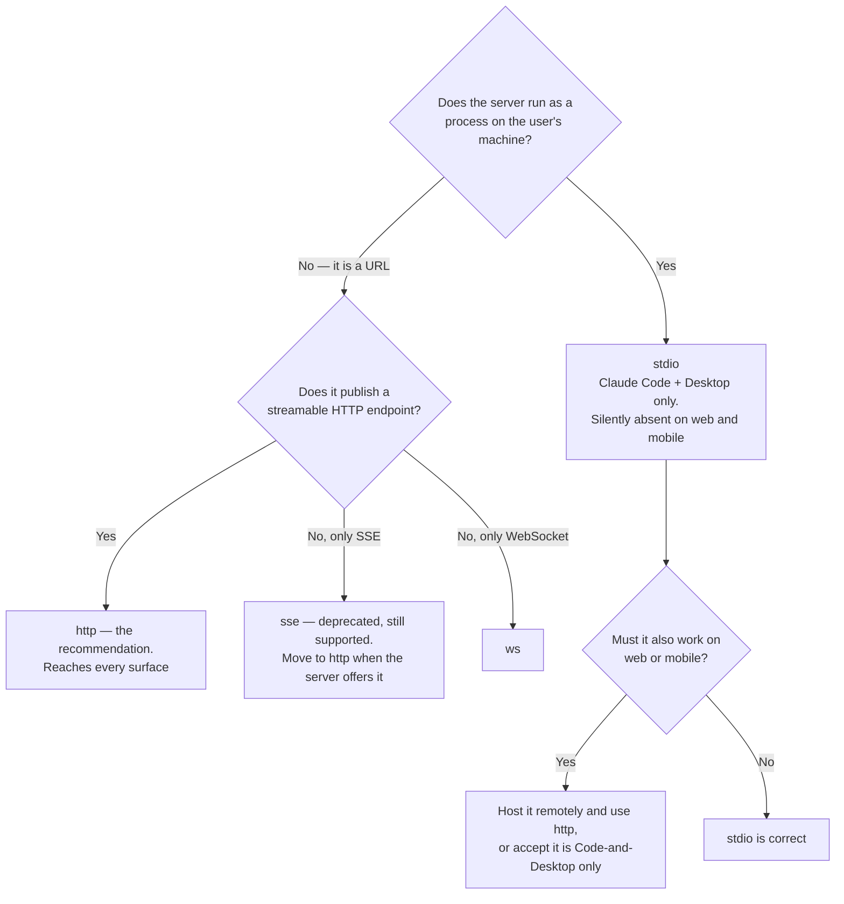

# The server entry: every field, every location, every name

Open this while writing or debugging a `.mcp.json` entry. The schema is small. The parts that cost people time are which transport to declare, which file wins, which placeholder resolves where, and what the server ends up being called.

## Table of Contents

- [Scope markers](#scope-markers)
- [Where a server can be configured](#where-a-server-can-be-configured)
- [Fields common to every transport](#fields-common-to-every-transport)
- [Transports](#transports)
- [`stdio` command resolution](#stdio-command-resolution)
- [Interpolation](#interpolation)
- [Where the credential comes from](#where-the-credential-comes-from)
- [Scope precedence](#scope-precedence)
- [Naming derivations, side by side](#naming-derivations-side-by-side)
- [Verification](#verification)

## Scope markers

Every option below is marked with where it is meaningful.

| Marker | Meaning |
|---|---|
| **Both** | Works in a standalone config and in a plugin-bundled one |
| **Plugin only** | Only meaningful once the config ships inside a plugin |
| **Standalone only** | Only meaningful outside a plugin, or has no plugin equivalent |

---

## Where a server can be configured

| Location | Scope marker | Written by | Committed | When it earns its place |
|---|---|---|---|---|
| `<plugin-root>/.mcp.json` | **Plugin only** | You, by hand | Yes, with the plugin | The server is part of what the plugin *is*. The default choice for a distributable plugin |
| `mcpServers` in `.claude-plugin/plugin.json` | **Plugin only** | You, by hand | Yes, with the plugin | One small entry, and a second file is more ceremony than it is worth |
| `<project>/.mcp.json` | **Standalone only** | You or `claude mcp add --scope project` | Yes, with the repo | Everyone working on this repo needs the same server |
| `~/.claude.json`, user scope | **Standalone only** | `claude mcp add --scope user` | No | One person, every project on their machine |
| Local scope | **Standalone only** | `claude mcp add` (default) | No | Experiments, and anything with a credential you would not commit |

The two plugin locations take the identical entry shape. `.mcp.json` is:

```json
{
  "mcpServers": {
    "<server-name>": { "type": "...", "...": "..." }
  }
}
```

and the inline form is that same `mcpServers` object as a top-level key of `plugin.json`. Pick one. Both present is ambiguous to a reader and offers no benefit.

`claude mcp add` (**Standalone only**) is a convenience over editing the file — it validates as it writes and picks the right file for `--scope`. It has no plugin mode: a plugin's `.mcp.json` is authored by hand, because it is source code you ship rather than machine state.

**The choice of location decides the tool names.** Only the two plugin locations produce `mcp__plugin_*` names. See the naming section at the end.

---

## Fields common to every transport

| Field | Type | Default | Scope | What it does, and when it earns its place |
|---|---|---|---|---|
| `type` | string | inferred | **Both** | `stdio`, `http` (alias `streamable-http`), `sse`, `ws`. Write it explicitly even where it could be inferred from the presence of `command` or `url` — an explicit `type` is what makes a later transport swap a one-line change instead of an archaeology exercise |
| `timeout` | number | transport default | **Both** | How long to wait for the server to become ready. Reach for it when a `stdio` server has a slow cold start — a container pull, a language server indexing a large repo — and the default gives up first. Confirm the unit against current docs before setting it; a value wrong by a factor of 1000 either never times out or times out instantly |
| `alwaysLoad` | boolean | `false` | **Both** | Connect at session start rather than on first need. Earns its place when a tool must be discoverable on turn one without the user naming it. Costs a connection, and possibly an auth prompt, every session whether or not anything uses the server |
| `oauth` | object | absent | **Both** | Configures the OAuth exchange for a server that needs more than discovery provides. Most OAuth servers need nothing here — the user authenticates from `/mcp` or `claude mcp login <name>` and Claude Code stores and refreshes the tokens. Reach for it only when the server documents settings the discovery flow cannot infer, and check the current docs for the sub-field names |

`headers` and `headersHelper` are common to the three URL transports and are documented under `http` below. `env` is `stdio`-only.

---

## Transports

### Which one

Two questions decide it, and the second is the distribution decision in disguise — a transport is not only how Claude Code talks to the server, it is which surfaces can reach the server at all.



"Silently absent" is literal: on web and mobile a `stdio` server produces no error, its tools are simply not in the model's tool list, and the symptom the user reports is that Claude got it wrong on their phone. Read `../../../shared/references/distribution-targets.md` when a surface you cannot test from here has to be covered — it has the artifact-by-surface matrix behind this branch.

### `stdio` — a local process

| Field | Required | Scope | Notes |
|---|---|---|---|
| `type` | recommended | **Both** | `"stdio"` |
| `command` | **yes** | **Both** | The executable. Resolution rules below |
| `args` | no | **Both** | Array of strings. Each element interpolates independently, so a path argument does not need quoting the way a shell string does |
| `env` | no | **Both** | Object of string to string, merged into the child process environment. The natural home for a credential a `stdio` server reads from its own environment |

```json
{
  "type": "stdio",
  "command": "bun",
  "args": ["${CLAUDE_PLUGIN_ROOT}/servers/repo-index/index.ts"],
  "env": { "INDEX_CACHE": "${CLAUDE_PLUGIN_DATA}/repo-index" }
}
```

Note where each anchor goes. Shipped code reads from the plugin root; anything the server writes goes to the plugin data directory, because the plugin root is replaced wholesale on update and anything written there is lost without warning. Read `../../plugin-creator/references/path-anchors.md` before you write either anchor into a real entry: it is read rather than injected, so it carries the literal tokens, and it says which of the three each job wants.

### `http` — the recommendation for anything remote

| Field | Required | Scope | Notes |
|---|---|---|---|
| `type` | recommended | **Both** | `"http"`, or `"streamable-http"` — the same transport under two accepted names |
| `url` | **yes** | **Both** | The endpoint |
| `headers` | no | **Both** | Object of string to string, sent on every request. Fully interpolated, including the `user_config` placeholder |
| `headersHelper` | no | **Both** (with a **Plugin only** constraint) | A command run at connection time that prints a JSON object of headers on stdout |

`headersHelper` receives `CLAUDE_CODE_MCP_SERVER_NAME` and `CLAUDE_CODE_MCP_SERVER_URL` in its environment, so one helper script can serve several entries. It is the right tool for a header that must be computed fresh per connection — a short-lived token, a request signature, a value pulled from an OS credential store.

**The plugin constraint:** `headersHelper` is shell-parsed, so it cannot reference `${user_config.*}` values. The plugin path anchors *do* resolve in it, so a bundled helper script is addressable, but a `user_config` reference inside the helper string arrives unexpanded and the header comes out as literal placeholder text. A manifest-configured value belongs in static `headers`.

Both fields together is the normal shape for a plugin, not a workaround:

```json
{
  "type": "http",
  "url": "https://metrics.example.com/mcp",
  "headers": { "X-Acme-Tenant": "${user_config.tenantId}" },
  "headersHelper": "bun \"${CLAUDE_PLUGIN_ROOT}/scripts/mint-metrics-token.ts\""
}
```

The tenant comes from the manifest prompt and resolves in `headers`; the bearer token is minted per connection by the helper. Quote the path — an unquoted one breaks on the first install directory containing a space.

### `sse` — deprecated, still supported

Same fields as `http`. It works, so an inherited entry needs no emergency fix. Where a server publishes both an `sse` and an `http` endpoint it is telling you which one it intends to keep: change `type` to `http`, point `url` at the streamable endpoint, leave everything else.

### `ws` — WebSocket

`url`, plus the same header fields. Correct when the server speaks nothing else.

---

## `stdio` command resolution

The `command` runs on the user's machine, from a working directory you do not control.

| Form | What happens | Verdict |
|---|---|---|
| Bare relative — `./server/index.ts` | Resolves against the working directory, so it points into whatever project the user is sitting in. It may not exist; worse, it may exist and be something else | Never |
| Absolute from your machine — `/Users/you/src/...` | Breaks on the first install that is not yours | Never |
| Anchored — the plugin-root placeholder plus a path, quoted | Resolves to the installed location wherever that is | The form to use for shipped code |
| Bare binary on `PATH` — a runtime the server needs | Resolves through the user's `PATH` | Fine for a runtime you have told the user to install; a gamble for anything else |
| Package runner — a registry fetch on first run | Fetches on first run | Convenient, and it makes startup depend on a network and a registry. Worth a README note |
| Compiled binary under the plugin root | Runs with no runtime installed at all | The strongest form when you can build it, and the one with a per-platform build cost |

**A server this plugin writes is spawned with `bun`, pointed at a TypeScript entry point under the plugin root.** Claude Code will spawn whatever `command` names — the field is a process, not a runtime allow-list — so an inherited entry running some other interpreter is not broken and does not need an emergency rewrite. What the choice costs is a prerequisite on somebody else's machine, and the ranking above is by how much of that cost the user pays. `bun build --compile` is the one form that removes it entirely: it emits a single-file executable that needs nothing installed, at the price of one artifact per platform. Read `../../../shared/references/pure-bun.md` when you are choosing between those forms, for the compile targets and what each one still assumes.

Where you depend on a runtime the user may not have, say so in the README and fail with a message that names the missing thing. A `command not found` surfacing as a bare connection failure sends people to their credentials.

---

## Interpolation

### The grid

Which placeholder resolves in which field.

| Placeholder | Scope | `command` | `args` | `env` | `url` | `headers` | `headersHelper` |
|---|---|---|---|---|---|---|---|
| `${VAR}` | **Both** | yes | yes | yes | yes | yes | no |
| `${VAR:-default}` | **Both** | yes | yes | yes | yes | yes | no |
| `${CLAUDE_PLUGIN_ROOT}` | **Plugin only** | yes | yes | yes | yes | yes | yes |
| `${CLAUDE_PLUGIN_DATA}` | **Plugin only** | yes | yes | yes | yes | yes | yes |
| `${CLAUDE_PROJECT_DIR}` | **Both** | yes | yes | yes | yes | yes | yes |
| `${user_config.<key>}` | **Plugin only** | yes | yes | yes | yes | yes | no |

The two rows that trip people are the last one and the `headersHelper` column. The plugin path anchors are the only placeholders that reach inside `headersHelper`, because the helper string is shell-parsed rather than run through the config interpolator.

Nothing interpolates in the server-name key, or in `type`. A server name is a literal.

### Semantics

**An unset variable with no default does not fail.** It loads as the literal placeholder text, with a warning. So a header referencing an unset token is sent as the placeholder's own characters, the server replies 401, and the session reports what looks like a credential failure. Check for the warning before questioning the token.

**A default makes the entry self-sufficient** — and makes it wrong for a secret, since a default secret is a committed secret. Defaults belong on base URLs, regions, model names, log levels.

**`env` is the child's environment, not yours.** A `stdio` server sees exactly what `env` supplies plus whatever it inherits; a variable you have exported but not named in `env` may or may not reach it, so name the ones the server requires rather than relying on inheritance.

---

## Where the credential comes from

Four sources, ordered by how much each asks of a user who is not you. The skill body states the default; this is what to write once you have picked one, and what each costs.

**1. OAuth — the default wherever the server offers it.** Configure no credential at all. The user runs `/mcp`, selects the server and authenticates in a browser; `claude mcp login <name>` does the same from a shell. Claude Code stores and refreshes the tokens, so nothing sensitive is ever in your repo or theirs. An entry with no credential field is not an oversight — it is what this looks like.

**2. `userConfig` in the plugin manifest — the default for a distributable plugin whose server has no OAuth.** Declare the value as a manifest option, and Claude Code prompts for it, schema-validates it, and with `sensitive: true` routes it to secure storage rather than plaintext on disk. Reference it from `headers` with the `user_config` placeholder.

```json
{
  "userConfig": {
    "trackerToken": {
      "type": "string",
      "title": "Issue tracker token",
      "description": "Personal access token with issues:read",
      "sensitive": true,
      "required": true
    }
  }
}
```

`type`, `title` and `description` are all required — `claude plugin validate` errors on a missing `title`. A `user_config` reference naming a key the manifest never declares resolves to nothing and prompts nobody, which is a connection failure with no message pointing at the cause. `../../../shared/references/plugin-skills.md` carries the full option schema.

**3. A variable from the user's own environment.** Cheapest to write and fine for a developer audience, and the one whose failure is worst: an unset variable with no default loads as its own placeholder text plus a warning, so the server answers 401 and everyone reads it as a bad token. Taking this option obliges you to name every required variable in the README, because that list is the only thing standing between a user and that 401.

**4. A variable with a `:-` default.** Right for a value with a sane fallback — a base URL, a region, a model name — and wrong for a secret, because a default secret is a committed secret and git history keeps it after you delete it.

**`headersHelper` sits alongside all four rather than among them.** It is a command run at connection time that prints a JSON object of headers, for a value that must be computed fresh per connection: a short-lived token, a request signature, a lookup in an OS credential store. See the `http` section above for its fields, its environment, and the constraint that it cannot see `user_config` values.

**What never goes in the file.** A token, key, password or signed URL written literally into `.mcp.json` or `plugin.json` is committed the moment the repo is, and recovery is rotation rather than a follow-up commit. The check is mechanical: every credential-shaped value is a placeholder, and the README names each variable the user must supply.

---

## Scope precedence

Highest first:

```
local  →  project .mcp.json  →  user  →  plugin  →  claude.ai connectors
```

The first three match by **server name**. The last two match by **URL or endpoint**.

**The winning source supplies the whole entry. Fields are never merged.** A user-scope entry named `issue-tracker` carrying only a `url` completely replaces a plugin entry of the same name that had `url`, `headers`, `headersHelper` and a `timeout`. The headers are not inherited — they are gone, and the symptom is an authentication failure on a server that was working yesterday.

Two consequences worth designing around:

- **Name a plugin's servers distinctively.** A plugin server called `github` or `postgres` will eventually be shadowed by a user-scope entry of the same name on somebody's machine, and neither of you will have intended it. `acme-issue-tracker` collides with nothing.
- **`claude mcp get <name>` before debugging anything.** It prints which source won and the resolved entry. An edit that appears to have no effect is usually an edit to a file that lost.

**Workspace trust** gates a project `.mcp.json` in interactive sessions: the server does not connect until the user has accepted trust for that workspace, because a freshly cloned repo should not be able to start processes at them. Headless sessions load it without prompting. Read that asymmetry both ways — a server that "only works in CI" is usually a trust prompt nobody saw, and behaving in CI is no evidence it behaves for a human.

---

## Naming derivations, side by side

One server, four contexts, four different strings. This is the section to copy from.

Take a plugin named `acme-devtools`, a server keyed `issue-tracker`, and a tool the server exposes named `search_issues`.

| Context | Template | Derived value |
|---|---|---|
| Tool name, plugin-bundled | `mcp__plugin_<plugin>_<server>__<tool>` | `mcp__plugin_acme-devtools_issue-tracker__search_issues` |
| Tool name, user-configured | `mcp__<server>__<tool>` | `mcp__issue-tracker__search_issues` |
| Whole server, subagent `tools` | `mcp__plugin_<plugin>_<server>__*` | `mcp__plugin_acme-devtools_issue-tracker__*` |
| Whole server, settings permission rule | `mcp__<full-server-prefix>` | `mcp__plugin_acme-devtools_issue-tracker` |
| Hook `mcp_tool` handler, `server` field | `plugin:<plugin>:<server>` | `plugin:acme-devtools:issue-tracker` |
| Resource reference in a prompt | `@<server>:<protocol>://<path>` | `@issue-tracker:issue://PROJ-1421` |

**The sanitization step.** After substitution, every character outside `A-Za-z0-9_-` is replaced with `_`. Hyphens survive; dots, spaces, slashes and colons do not.

| Plugin | Server | Tool | Result |
|---|---|---|---|
| `acme-devtools` | `issue-tracker` | `search_issues` | `mcp__plugin_acme-devtools_issue-tracker__search_issues` |
| `acme-devtools` | `metrics.api` | `query.run` | `mcp__plugin_acme-devtools_metrics_api__query_run` |
| `acme-devtools` | `repo index` | `find_symbol` | `mcp__plugin_acme-devtools_repo_index__find_symbol` |

Two things fall out of that table. Server names containing anything but letters, digits, hyphens and underscores produce a tool name that does not look like the name you wrote — so prefer names that survive sanitization unchanged, and you never have to derive anything. And after sanitization `metrics.api` and `metrics_api` are indistinguishable to every grant, so a plugin must not ship both.

**Why the plugin form is easy to get wrong:** it differs from the user form by an *infix*, not a prefix. `mcp__issue-tracker__search_issues` is exactly what a working standalone grant looks like, and exactly what the server's own README will show. Pasted into a plugin, it is syntactically valid, matches nothing, and produces a permission prompt rather than an error.

The three places that will silently accept a wrong name:

- A skill's `allowed-tools` — the grant applies to nothing and the tool prompts every time
- A subagent's `tools` — the agent is denied a tool it was meant to have
- A settings `permissions.allow` rule — the same, at session scope

Settings permission rules take `mcp__<server>` to mean the whole server and `mcp__<server>__<tool>` for one tool. Subagent `tools` additionally documents `mcp__<server>__*` and `mcp__*`. Writing the exact tool name is unambiguous in both places, and is what to do whenever you are unsure which wildcard form a given field accepts.

Read the resource-reference form off `/mcp` rather than deriving it. It is the one of the six this plugin has not verified end to end for plugin-bundled servers.

---

## Verification

```bash
claude mcp list          # configured servers and their scopes
claude mcp get <name>    # the resolved entry, and which source won
claude mcp login <name>  # OAuth from the shell
```

`/mcp` in a session gives the interactive view: per-server state, the tool list, resources, and an authenticate option where the server wants one.

Each state means something different about where the fault is:

| State | What it means | Where to look next |
|---|---|---|
| Connected | Handshake done, tool list arrived. The only state in which the server's tools exist in the model's tool list | Check the tool *names* — connected is not granted |
| Failed | The process exited, the URL did not answer, or the handshake errored | `stdio`: run the `command` in a shell. `http`: request the `url` with the same headers |
| Needs authentication | Reached, and it wants OAuth before handing over a tool list | Authenticate from `/mcp`, or `claude mcp login <name>` |
| Not listed | The entry was never parsed, or a higher-precedence scope replaced it | `claude mcp get <name>`, then the precedence section above |

A lazily-connected server shows nothing until something uses it, which is not by itself a fault.
